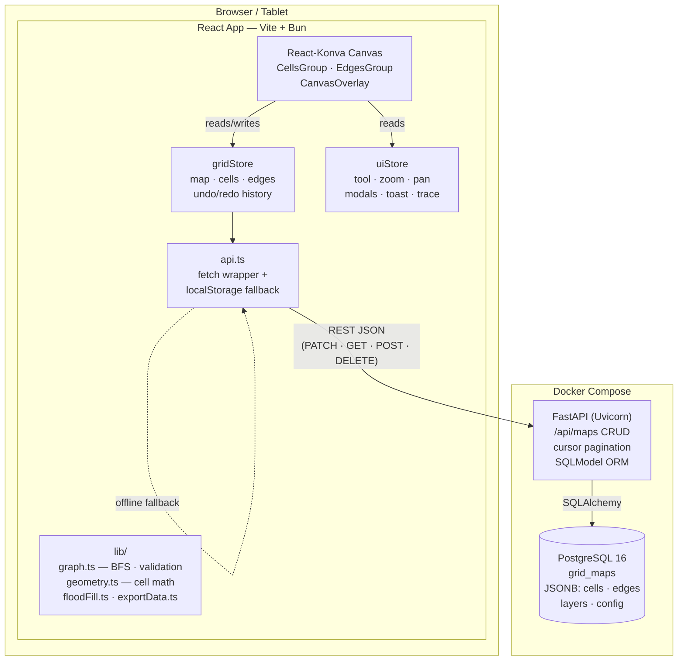

# Naxa — Visual Navigation Map Editor for Autonomous Mobile Robots

> Design. Validate. Export. Deploy.

Naxa is an open-source, browser-based grid map editor purpose-built for autonomous mobile robot (AMR) and grid-based navigation systems. It gives operators, system integrators, and robotics engineers a whiteboard-style interface to visually compose navigation graphs — directed cell networks with semantic node types, connectivity validation, and route simulation — and export them in any format a navigation stack can consume.

No proprietary fleet software. No hand-writing JSON. Just draw, validate, and ship.

---

## What Naxa Solves

Designing navigation graphs for AMR systems today means one of two things: writing JSON or YAML by hand (error-prone, non-visual, takes hours), or licensing expensive fleet management platforms like RMF, MiR Fleet, or Fetch Cloud. Neither is accessible to small teams or custom deployments.

Naxa fills that gap. A 20×20 map with sources, destinations, charging stations, and validated routing takes under five minutes — and exports to whatever format your stack expects.

---

## Core Capabilities

| Capability | Description |
|---|---|
| **Multi-shape grids** | Square, rectangular, and hexagonal cells — up to 1000×1000 |
| **Directed lane drawing** | Drag across cells to create navigable edges with direction arrows; click to toggle bidirectional |
| **Semantic node typing** | 8 node types (traversable, path, source, destination, charging, parking, blocked, junction), each with VDA5050/MiR-inspired subtypes |
| **Layer system** | Toggle visibility per node type; per-layer cell counts |
| **Flood fill** | Click any unassigned region to fill all contiguous unassigned cells in one action |
| **Bulk select** | Drag a selection rectangle; apply the active type to all cells inside |
| **Undo / redo** | 50-step snapshot history (Ctrl+Z / Ctrl+Y) |
| **BFS connectivity validation** | Multi-source BFS from all sources; reports unreachable destinations, charging, and parking cells |
| **Path preview** | Click any two cells to display the BFS shortest path |
| **Trace animation** | Animate all source→destination robot routes simultaneously with configurable speed |
| **Custom JSON/YAML export** | Configurable field names, coordinate origin, optional sections — ships with `naxa`, `ros2`, and `amr` presets |
| **PNG / CAD export** | Full-resolution canvas snapshot or dimension-annotated CAD image with 1-indexed coordinate labels |
| **Viewport culling** | Renders only on-screen cells; smooth at large grid sizes |
| **Offline-first** | localStorage fallback when the backend is unreachable — works as a standalone tool with no server |
| **Dark / light theme** | All panes and the canvas switch together |
| **Real-world scale** | Calibrate maps to meters per cell; rectangular grids support independent column-width and row-height |

---

## Quick Start

**Prerequisite:** Docker

```bash
git clone https://github.com/ps-icode/naxa.git
cd naxa
docker compose up
```

| Service    | URL                        |
|------------|----------------------------|
| Web app    | http://localhost:3000      |
| API        | http://localhost:8000      |
| API docs   | http://localhost:8000/docs |

---

## Using the Editor

### 1. Create a map
Click **+ New Map** in the sidebar. Set a name, grid shape, dimensions (rows × cols, up to 1000×1000), and real-world cell size in meters.

### 2. Draw lanes
Select **Draw** (`D`). Drag across adjacent cells to create directed navigation edges. Click an arrow to toggle the lane bidirectional.

### 3. Assign node types
Select **Type** (`T`), pick a node type from the layer panel, then click or drag to paint cells.
Use **Fill** (`F`) to flood-fill all contiguous unassigned cells, or **Select** (`S`) to bulk-apply a type to a rectangular region.

### 4. Validate connectivity
Click **Validate** — runs multi-source BFS from all source cells. Unreachable destinations, charging stations, and parking bays are highlighted red. Switch to **Path** (`P`) to preview the shortest BFS route between any two cells.

### 5. Simulate robot traversal
Click **▶ Trace** to animate all source→destination routes simultaneously. Adjust speed (1–10×) and watch the legend for route labels. Press **⏹** to stop.

### 6. Save & export
- **Save** — persists to the PostgreSQL backend; also cached in localStorage
- **Export** — opens the export modal: choose JSON or YAML, configure field names and coordinate origin
- **PNG** / **CAD** — raster snapshots of the current canvas view

### Keyboard shortcuts

| Key        | Action                  |
|------------|-------------------------|
| `D`        | Draw tool               |
| `T`        | Type tool               |
| `E`        | Erase tool              |
| `S`        | Select tool             |
| `F`        | Fill tool               |
| `P`        | Path tool               |
| `Ctrl+Z`   | Undo                    |
| `Ctrl+Y`   | Redo                    |
| `Delete`   | Delete selected edge    |

Shortcuts are suppressed when focus is inside an input or textarea.

---

## Node Types

| Node Type   | Color     | Purpose                                                   |
|-------------|-----------|-----------------------------------------------------------|
| traversable | `#0ea5e9` | Generic passable floor — aisles, staging, open corridors  |
| path        | `#4a5568` | Directed corridors created by the Draw tool               |
| source      | `#22c55e` | Robot pickup, induction, or load points                   |
| destination | `#3b82f6` | Robot drop-off, delivery, or output endpoints             |
| charging    | `#f59e0b` | Battery charging stations                                 |
| parking     | `#a855f7` | Idle bays, maintenance positions                          |
| blocked     | `#ef4444` | Walls, pillars, equipment, no-go zones                    |
| junction    | `#06b6d4` | Merge, diverge, and crossover points                      |

Cells that have never been explicitly assigned by the user render as a subtle hatch pattern. They are distinct from explicitly-blocked cells — the erase tool returns cells to this unassigned state, and the flood-fill tool operates only on unassigned cells.

---

## Export Formats

The export modal lets you configure every field name in the output. Three presets are built in:

| Preset | `nodeType` key | `row` key | `col` key | `from` key  | `to` key    |
|--------|---------------|-----------|-----------|-------------|-------------|
| naxa   | `nodeType`    | `row`     | `col`     | `from`      | `to`        |
| ros2   | `type`        | `y`       | `x`       | `source`    | `target`    |
| amr    | `node_type`   | `row`     | `col`     | `from_node` | `to_node`   |

Output includes per-cell subtype, label, metadata, and per-edge cost. Config block and layers list are optional sections.

---

## Running Tests

All test tooling runs inside Docker — no host install of bun or uv required.

```bash
# Frontend: 278 tests, 100% coverage on lib/ and store/
docker run --rm -v $(pwd):/naxa -w /naxa/apps/web naxa-web:latest bun test:coverage

# Backend: 14 tests covering all CRUD routes + pagination
docker run --rm -v $(pwd)/apps/api:/app naxa-api:latest uv run pytest tests/ -v
```

---

## API Reference

| Method   | Path              | Description                                        |
|----------|-------------------|----------------------------------------------------|
| `GET`    | `/health`         | Health check                                       |
| `GET`    | `/api/maps`       | List maps (`?limit=50&cursor=<token>`)             |
| `POST`   | `/api/maps`       | Create a map                                       |
| `GET`    | `/api/maps/{id}`  | Get map by ID                                      |
| `PATCH`  | `/api/maps/{id}`  | Update a map                                       |
| `DELETE` | `/api/maps/{id}`  | Delete a map                                       |

`GET /api/maps` uses cursor-based pagination. Pass `?limit=N&cursor=<token>` and read the `X-Next-Cursor` response header for the next page token. Sort order: `updated_at DESC, id ASC`.

---

## Environment Variables

### Backend (`apps/api/.env`)

| Variable          | Default                 | Description                           |
|-------------------|-------------------------|---------------------------------------|
| `DATABASE_URL`    | _(required)_            | PostgreSQL connection string          |
| `ALLOWED_ORIGINS` | `http://localhost:3000` | Comma-separated CORS allowed origins  |

Copy `apps/api/.env.example` to `apps/api/.env` to get started.

---

## Monorepo Structure

```
naxa/
├── apps/
│   ├── web/          # React 18 + TypeScript + Vite + React-Konva (primary UI)
│   ├── api/          # FastAPI + SQLModel + PostgreSQL (REST backend)
│   └── mobile/       # Placeholder — future React Native app
├── packages/
│   └── core/         # Shared TypeScript domain types (@naxa/core)
├── infra/
│   └── docker/       # Dockerfile.web, Dockerfile.api
├── docs/             # PRD, Architecture, SDD, dev notes, roadmap
└── docker-compose.yml
```

---

## Tech Stack

| Layer      | Technology                                         |
|------------|----------------------------------------------------|
| Frontend   | React 18, TypeScript, Vite, React-Konva, Zustand   |
| Backend    | FastAPI, SQLModel, Alembic, Uvicorn                |
| Database   | PostgreSQL 16 (JSONB for grid data)                |
| Tooling    | Bun (JS runtime + package manager), uv + ruff      |
| Testing    | Vitest + Istanbul (frontend), pytest (backend)     |
| CI         | GitHub Actions (lint, typecheck, test on every push) |

---

## Architecture Overview



Key design decisions:
- **Two Zustand stores** — `gridStore` owns all map data and undo/redo history; `uiStore` owns all view state. Clean separation means canvas redraws never touch data, and data saves never trigger viewport re-renders.
- **Pan/zoom via Konva refs** — zoom and pan values bypass React state entirely, eliminating jank on scroll and pinch.
- **RAF-batched paint/erase** — mouse-move events queue cell updates; a single `requestAnimationFrame` drains the queue. One snapshot per stroke, not per pixel.
- **UUID cell IDs** — cells are identified by `crypto.randomUUID()`, not coordinate strings. Required for safe grid resize and copy-paste, and makes edge IDs (`e_{fromId}_{toId}`) stable across renames.
- **JSONB for grid data** — cells and edges are always read and written as complete arrays. No normalization overhead, no partial-update complexity.
- **Viewport culling** — only cells within the visible canvas bounds are passed to the Konva scene graph, capped with a 100ms debounce on pan/zoom.
- **Schema migration pipeline** — `migrateMap()` runs a versioned sequence of transforms on every map loaded from storage, keeping old saves forward-compatible without server-side migrations.

---

## Documentation

- [Product Requirements Document](docs/PRD.md)
- [Architecture](docs/ARCHITECTURE.md)
- [Software Design Document](docs/SDD.md)
- [Development Status](docs/dev/STATUS.md)
- [Roadmap](docs/dev/ROADMAP.md)

---

## Status & Roadmap

**Current: v0.19 — Complete**

| Version    | Milestone                                                         | Status       |
|------------|-------------------------------------------------------------------|--------------|
| v0.1–v0.17 | Core editor, hex support, validation, trace, themes, CAD export   | Done         |
| v0.18      | Custom JSON/YAML export with field name presets                   | Done         |
| v0.19      | UUID cell IDs, schema migration, viewport culling, API pagination | Done         |
| **v0.2**   | **JWT auth, map ownership, shareable read-only links**            | **Next**     |
| v0.21      | Soft delete, grid resize, expanded backend coverage               | Planned      |
| v0.3       | ROS 2 / nav2 costmap export (pgm + yaml)                         | Planned      |
| v0.4       | VDA5050-compatible AMR fleet graph export                         | Planned      |
| v0.5       | React Native mobile app                                           | Planned      |
| v1.0       | Real-time collaboration, robot telemetry overlay                  | Future       |

[See full changelog →](docs/dev/STATUS.md)

---

## Contributing

This project is under active development. Issues and PRs are welcome.

- Branch: `production`
- Commit style: imperative present tense (`Add BFS timeout guard`)
- Tests are required for all changes to `lib/` and `store/`
- Run linting before submitting: `bun run lint` (frontend), `uv run ruff check src/` (backend)
