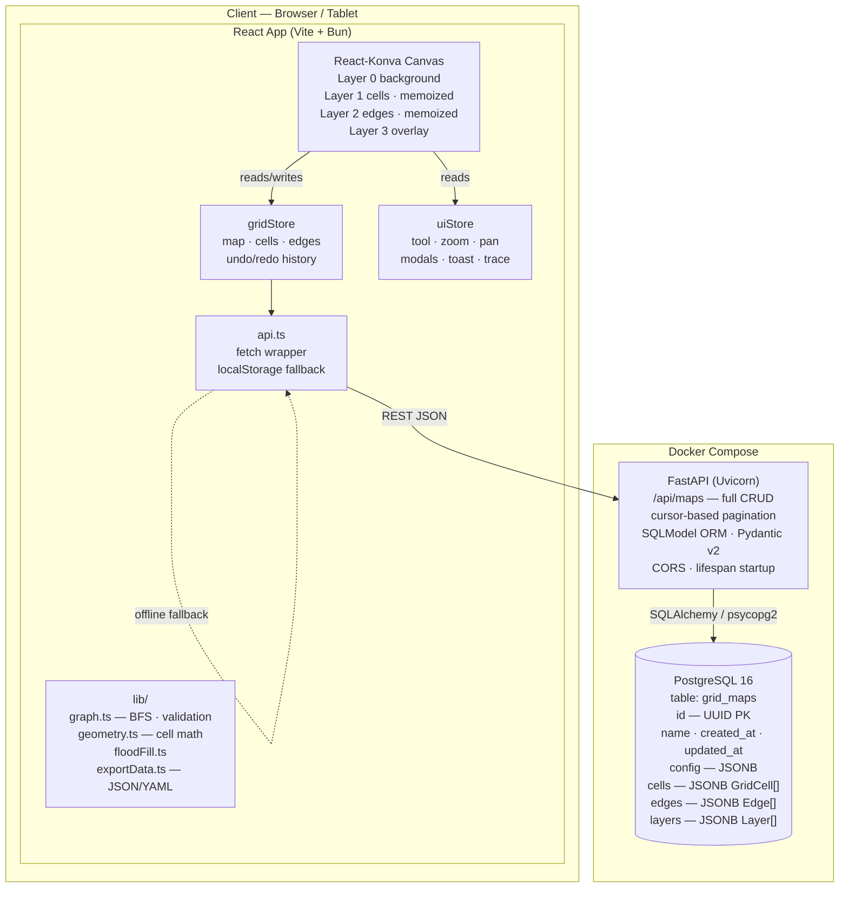
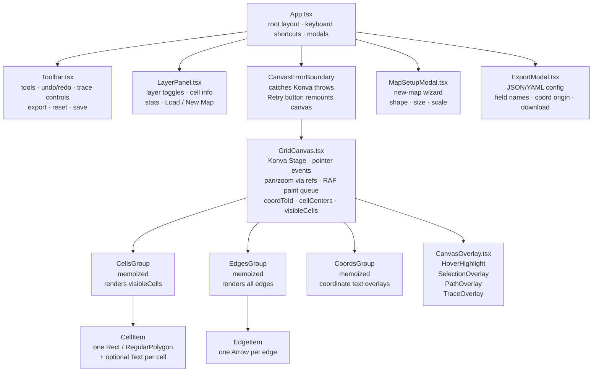
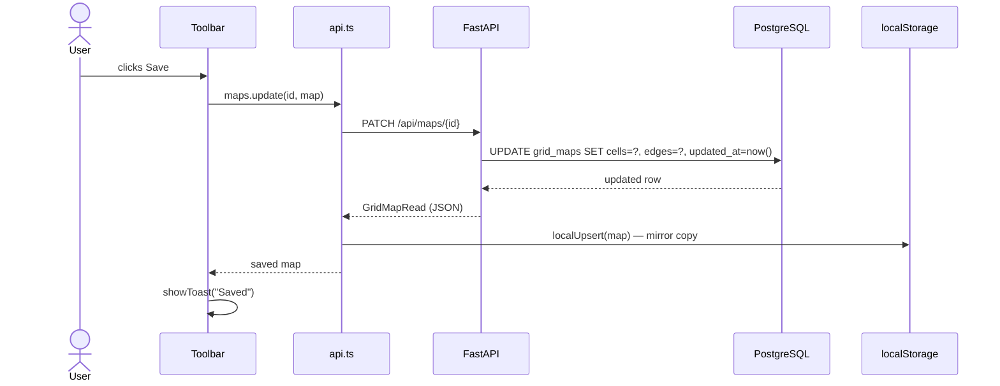
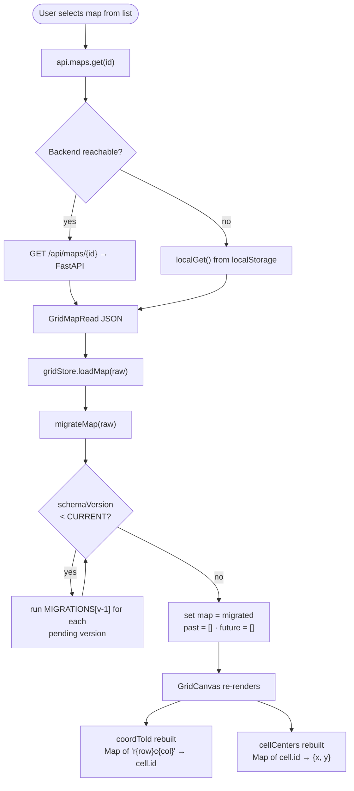
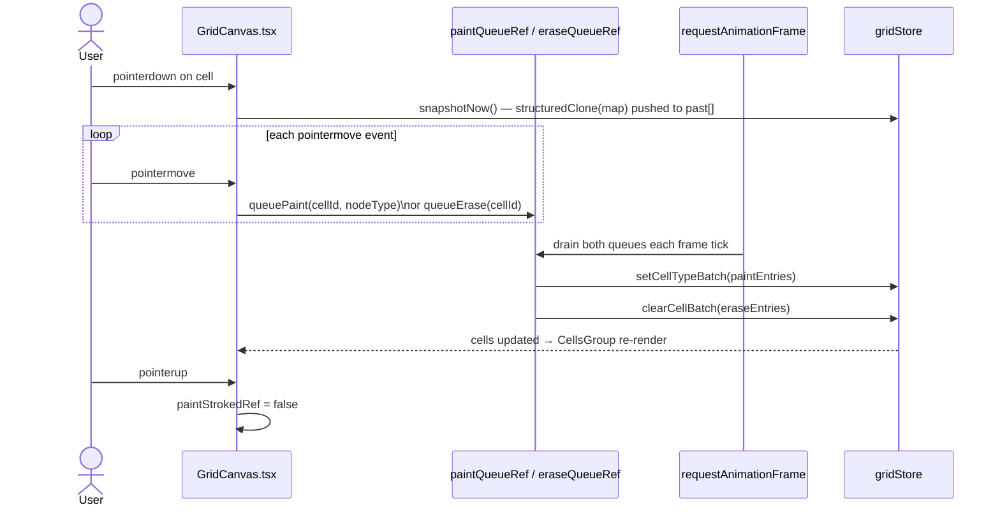
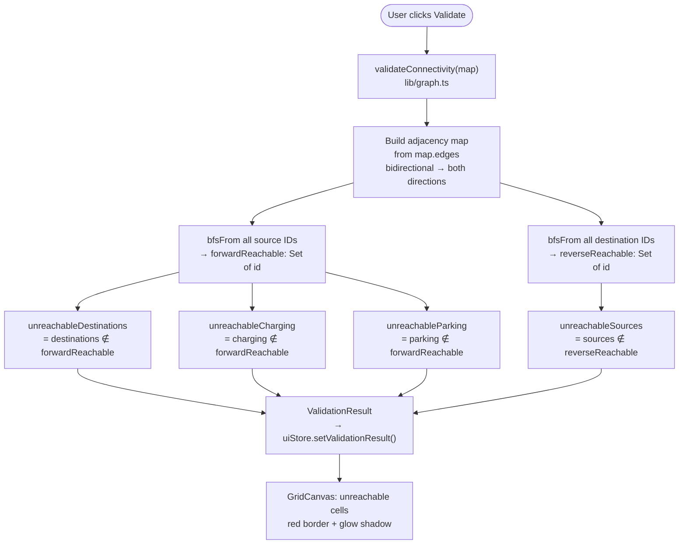
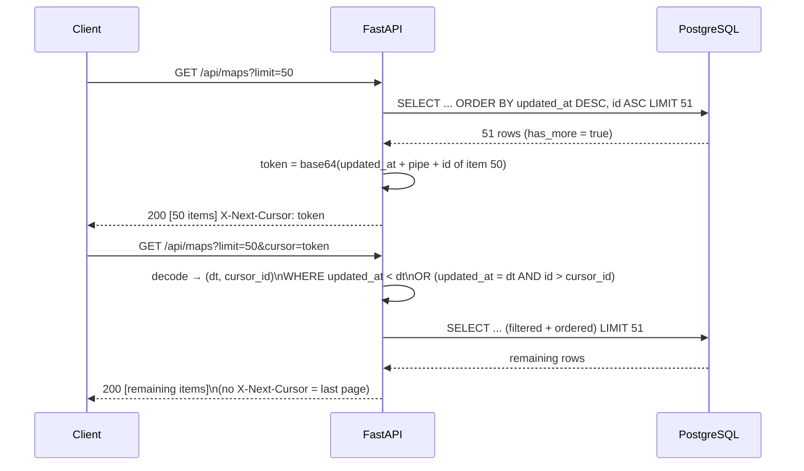

# Architecture — Naxa

**Version:** 0.19.0
**Last updated:** 2026-06-29

---

## 1. System Block Diagram



---

## 2. Component Hierarchy



---

## 3. Data Flow Diagrams

### 3.1 Save Map



### 3.2 Load Map



### 3.3 Paint Stroke (Type / Erase Tool)



### 3.4 BFS Connectivity Validation



### 3.5 API Cursor Pagination



---

## 4. Frontend Architecture

```
apps/web/src/
├── App.tsx                        # Root layout, keyboard shortcuts, modal gates
├── components/
│   ├── Canvas/
│   │   ├── GridCanvas.tsx         # Konva Stage: all rendering + pointer/gesture logic
│   │   ├── CanvasErrorBoundary.tsx  # React class ErrorBoundary wrapping GridCanvas
│   │   └── CanvasOverlay.tsx      # Hover, selection, path, trace overlays (extracted)
│   ├── Export/
│   │   └── ExportModal.tsx        # Custom JSON/YAML export modal
│   ├── LayerPanel/
│   │   └── LayerPanel.tsx         # Layer toggles, cell info panel, stats, load/new
│   ├── MapSetup/
│   │   └── MapSetupModal.tsx      # New-map wizard (shape, size, scale)
│   └── Toolbar/
│       └── Toolbar.tsx            # Tool picker, actions, trace controls, view toggles
├── store/
│   ├── gridStore.ts               # Map data: cells, edges, config + undo/redo history
│   └── uiStore.ts                 # UI state: tool, zoom/pan, modals, toast, trace, selection
├── lib/
│   ├── api.ts                     # fetch wrapper for FastAPI + localStorage fallback
│   ├── export.ts                  # PNG/CAD export (Konva-dependent)
│   ├── exportData.ts              # JSON/YAML serialization (pure, no Konva, testable)
│   ├── graph.ts                   # Adjacency graph, BFS, validation, trace routes
│   ├── themes.ts                  # PANE_THEMES: dark/light color tokens
│   └── grid/
│       ├── floodFill.ts           # BFS flood-fill through unassigned cells
│       └── geometry.ts            # Cell center/corner math for sq/rect/hex
└── __tests__/
    ├── lib/
    │   ├── api.test.ts
    │   ├── export.test.ts
    │   ├── floodFill.test.ts
    │   ├── geometry.test.ts
    │   ├── graph.test.ts
    │   └── performance.test.ts
    └── store/
        ├── gridStore.test.ts
        └── uiStore.test.ts
```

### Key Frontend Patterns

**Two Zustand stores (not three):**
- `gridStore` — all map data (cells, edges, config, layers) plus undo/redo past/future stacks
- `uiStore` — all view state (active tool, zoom/pan, modal visibility, toast, trace, selection)
- History is embedded in gridStore, not a separate store (avoids cross-store subscription complexity)

**Snapshot-based undo/redo:**
- `snap(state)` clones `state.map` into `past[]` (capped at 50 via `slice(-49)`)
- `undo` / `redo` swap current map with past/future stacks
- Paint strokes call `snapshotNow()` once at stroke start, then stream `setCellTypeBatch` updates (no per-cell snapshots)

**RAF-batched paint/erase:**
- Two refs: `paintQueueRef: Map<id, NodeType>` and `eraseQueueRef: Set<id>`
- Both drained by a shared RAF tick (`rafPaintRef`)
- Prevents hundreds of store updates per mouse-move event

**Pan/zoom via refs, not state:**
- Zoom/pan values live in `zoomRef` / `panRef`, not Zustand
- `applyTransform()` calls `stageRef.current.scale/position()` directly
- React only re-renders at tool switch, not on every scroll event

**`assigned` flag semantics:**
- `assigned: false` (or absent) = default/untyped cell — hatch rendered, floodable
- `assigned: true` = explicitly typed by user — full color, including red for explicit blocked
- `clearCellBatch()` resets to `assigned: false` (erase tool)
- `setCellType/Batch()` sets to `assigned: true` (type/draw tool)

---

## 5. Backend Architecture

```
apps/api/
├── src/
│   ├── main.py          # FastAPI app, CORS, lifespan (create_db_and_tables)
│   ├── db/
│   │   └── session.py   # SQLAlchemy engine + session factory
│   ├── models/
│   │   └── map.py       # GridMap SQLModel table + request/response Pydantic schemas
│   └── routes/
│       └── maps.py      # Full CRUD: GET list (cursor-paginated), POST, GET, PATCH, DELETE
├── migrations/
│   ├── env.py           # Alembic env: loads SQLModel metadata, reads DATABASE_URL
│   ├── script.py.mako   # Template for new migration files
│   └── versions/
│       └── 001_initial_schema.py  # Creates grid_maps table
├── alembic.ini
└── tests/
    ├── conftest.py      # SQLite in-memory engine, monkey-patches session.engine before imports
    └── test_maps.py     # 14 route tests covering all CRUD + pagination operations
```

**Key backend decisions:**
- Grid data stored as JSON columns — always read/written whole; no normalization needed
- SQLModel unifies SQLAlchemy ORM + Pydantic v2 (no duplicate model definitions)
- Lifespan function handles `create_db_and_tables()` (not deprecated `@app.on_event`)
- Docker healthcheck prevents FastAPI from starting before PostgreSQL is ready
- StaticPool in tests ensures one in-memory SQLite DB shared across all test connections

---

## 6. Shared Types Package

```
packages/core/src/index.ts
```

Single source of truth for all domain types (web, future mobile):
- `NodeType` union: `traversable | path | source | destination | charging | parking | blocked | junction`
- `SUBTYPES` map: VDA5050/MiR/Locus-inspired subtype options per node type
- `GridCell`, `Edge`, `Layer`, `GridConfig`, `GridMap` interfaces
- `NODE_TYPE_COLORS` — canonical hex colors per node type
- `DEFAULT_LAYERS` — 8 pre-configured layer definitions
- `CURRENT_SCHEMA_VERSION` — bumped on breaking data model changes

---

## 7. Database Schema

### `grid_maps`

| Column      | Type      | Notes                                          |
|-------------|-----------|------------------------------------------------|
| id          | TEXT (PK) | UUID v4                                        |
| name        | TEXT      |                                                |
| config      | JSONB     | GridConfig: shape, rows, cols, cellSizeMeters  |
| cells       | JSONB     | GridCell[]: id, coord, nodeType, assigned, ... |
| edges       | JSONB     | Edge[]: id, from, to, direction, bidirectional |
| layers      | JSONB     | Layer[]: id, name, nodeType, visible, color    |
| created_at  | TIMESTAMP |                                                |
| updated_at  | TIMESTAMP |                                                |

**Missing index (known gap — see §9.2):** `(updated_at DESC, id ASC)` is needed for cursor pagination to avoid full table scans at scale.

---

## 8. Infrastructure

```
docker-compose.yml
├── postgres    (PostgreSQL 16, healthcheck: pg_isready)
├── api         (FastAPI, depends_on postgres:healthy, retry backoff in lifespan)
└── web         (Vite dev server, port 3000)

infra/
├── Dockerfile.web    (bun + Vite)
└── Dockerfile.api    (python:3.11-slim + uv + uvicorn)
```

**Port map:** web → 3000, api → 8000, postgres → 5432 (internal only)

**CI:** `.github/workflows/ci.yml` — four jobs run on every push/PR to `production`:
- `lint-web` — bun lint + typecheck
- `test-web` — 278 tests + 100% coverage enforcement
- `lint-api` — ruff check + format check
- `test-api` — 14 pytest tests (SQLite in-memory, no live DB needed)

---

## 9. Known Gaps & Improvement Plan

### 9.1 Performance (High Priority)

| Issue | Impact | Fix |
|-------|--------|-----|
| `queue.shift()` in BFS | O(n) per step — bottleneck at 1M cells | Replace with pointer-based queue: `let head = 0; while (head < q.length) curr = q[head++]` |
| `structuredClone` on full map per snapshot | Freezes UI at large grids | Switch to structural sharing: clone only the changed slice (`cells`, `edges`), not the entire `GridMap` |
| `cells.map(...)` scan on every batch update | O(n) for every paint tick | Store cells as `Map<id, GridCell>` internally; keep a stable ordered array only for rendering |
| Viewport culling debounced 100ms | Renders off-screen cells during fast pan | Also cull during the RAF paint cycle so large strokes skip invisible cells |
| `hitTestEdge` is O(n) on every mouse move | Degrades with many edges | Add a spatial grid bucket or k-d tree for edge hit-testing |

### 9.2 Backend (Medium Priority)

| Issue | Impact | Fix |
|-------|--------|-----|
| No composite index on `(updated_at DESC, id ASC)` | Full table scan on every paginated list | `CREATE INDEX ON grid_maps (updated_at DESC, id ASC)` — add as Alembic migration 002 |
| `schemaVersion` not stored as a Postgres column | Can't query/filter by version server-side | Add `schema_version INTEGER NOT NULL DEFAULT 2` column in migration 002 |
| No request body size limit | Client can POST 100 MB grid | Add FastAPI `max_body_size` middleware |
| No rate limiting | Any client can enumerate/delete all maps | Add `slowapi` or a reverse-proxy rate limit before auth lands (v0.2) |

### 9.3 Security (Pre-Hosting)

| Issue | Fix |
|-------|-----|
| Hardcoded `naxa:naxa` postgres creds in `docker-compose.yml` | Use environment variable `POSTGRES_PASSWORD` and inject from `.env` or secrets manager |
| No authentication (by design until v0.2) | Ship JWT auth as the first task of v0.2 before exposing to users |
| `allow_credentials=True` + wildcard methods/headers | Lock `allow_methods` and `allow_headers` to the specific values the client actually sends |

### 9.4 Testing Gaps

| Gap | Fix |
|-----|-----|
| No component tests for GridCanvas, Toolbar, LayerPanel | Add React Testing Library tests gated behind a Konva mock |
| Backend coverage < 100% | Track per-route branch coverage; add tests for `cells`/`edges` PATCH variants |
| SQLite vs PostgreSQL cursor ordering | Add a Postgres integration test in CI for the cursor pagination job |

---

## 10. Hosting Recommendation

### Minimum Viable (free tier, < 1 hour to deploy)

| Component | Service | Notes |
|-----------|---------|-------|
| Frontend (Vite build) | **Vercel** or **Netlify** | Static assets, global CDN, free |
| Backend (FastAPI) | **Railway** or **Render** | Dockerfile-based deploy, free tier |
| PostgreSQL | **Neon** (serverless) or Railway managed PG | Free tier, connection pooling |

### Production-Grade (post-v0.2 auth)

| Component | Service | Why |
|-----------|---------|-----|
| Frontend | **Cloudflare Pages** | Global CDN, zero cold starts, free |
| Backend + DB | **AWS ECS Fargate + RDS** or **GCP Cloud Run + Cloud SQL** | Scales to zero, production SLA |
| Alternative | **fly.io** | Runs the exact Docker Compose with minimal config changes |

### Pre-Hosting Checklist

Before exposing to users:

1. **JWT auth** (v0.2 scope) — without it, all maps are world-readable and deletable
2. **Secrets** — move `POSTGRES_PASSWORD`, `DATABASE_URL`, and `ALLOWED_ORIGINS` to a secrets manager (AWS SSM, Doppler, or `.env` via Railway)
3. **CORS** — lock `ALLOWED_ORIGINS` to your production domain
4. **Alembic in deploy** — run `alembic upgrade head` as a deploy step, not just `create_all` (which is idempotent but skips migration history)
5. **CI deploy step** — add a deploy job to `.github/workflows/ci.yml` triggered on merge to `production`
6. **Composite DB index** — add migration 002 before going live to avoid full table scans

The app's offline-first design (localStorage fallback) means it works even if the backend cold-starts on a free tier, which is a real advantage during early hosting.

---

## 11. Key Design Decisions Log

| Decision | Rationale |
|----------|-----------|
| React-Konva for canvas | Layered retained-mode scene graph with first-class touch/mouse support; cheaper show/hide per Layer than raw Canvas 2D |
| Two Zustand stores | gridStore (data) + uiStore (view) — clean separation; simpler than 3-store original design |
| History in gridStore | Avoids cross-store subscription complexity; snapshots are full GridMap clones |
| RAF-batched paint | Prevents per-pixel re-renders during drag; single snapshot per stroke |
| Pan/zoom via Konva refs | Decouples viewport from React render cycle; eliminates jank on scroll/pinch |
| `assigned` flag on GridCell | Cleanly separates "never touched" from "explicitly set to blocked"; fixes fill/erase semantics |
| `migrateMap()` pipeline | Versioned (CURRENT_SCHEMA_VERSION=2); v1→v2 adds `assigned` field; extensible for future changes |
| UUID cell IDs | Decouples cell identity from coordinates; required for safe grid resize and copy-paste |
| `coordToId` map in GridCanvas | `Map<'r{row}c{col}', cell.id>` — pointer events hit-test coords then look up UUID; O(1) |
| Viewport culling via `visibleCells` | `map.cells.filter(inViewportBounds)` debounced 100ms; prevents Konva from rendering off-screen cells |
| `CanvasOverlay.tsx` extraction | Keeps GridCanvas focused on input/layout; overlays are pure display components |
| `CanvasErrorBoundary` class component | React requires class components for error boundaries; catches Konva throws without crashing the app |
| Cursor-based API pagination | `GET /api/maps?limit=50&cursor=<base64>` + `X-Next-Cursor` header; stable under concurrent inserts vs. offset pagination |
| Alembic for schema migrations | `migrations/versions/` tracked in git; `alembic upgrade head` is idempotent for prod deploys |
| Pure `exportData.ts` (no Konva) | Allows JSON/YAML serialization to be tested in Vitest without browser/canvas shims |
| Istanbul coverage (not v8) | Bun uses JavaScriptCore; V8 coverage APIs unavailable; Istanbul works via instrumentation |
| JSONB for grid data in Postgres | Arrays always read/written whole; no query filtering on individual cells needed |
| localStorage fallback in api.ts | Enables offline usage and demos without running the backend |
